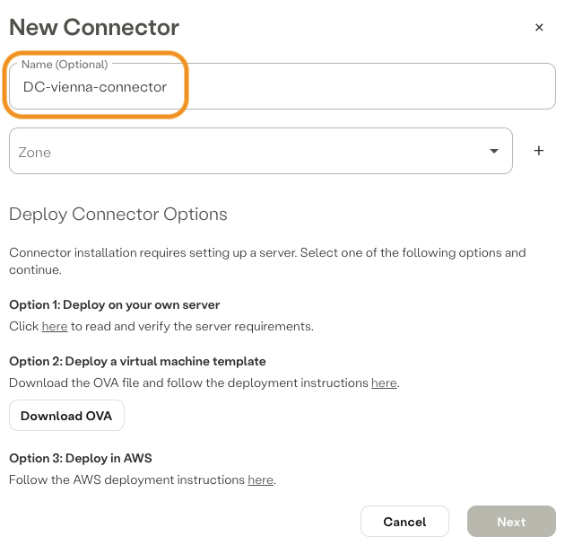

[Promox Virtual Environment]: https://www.proxmox.com/en/
[Axis Security]: https://www.axissecurity.com/schedule-a-demo/
[Axis Securtiy Workspace]: https://auth.axissecurity.com/

## ✅ Prerequisites

- [Axis Securtiy Workspace]

- [Promox Virtual Environment]

## Overview

Deploy Atmos Connector on Promox Virtual Environment
- Atmos Connector Version: 3.51.1
- Proxmox Virtual Environment Version: 8.2.2

## 🚀 Installation

1) Connect to the Management System of Axis Security:

```text
https://auth.axissecurity.com/
```

2) Naviagte to:
`settings` ➡️ `connectors` 

3) Create Connector:
`New Connector`

Step 1:


Step 2:


Step 3:


Step 4:

❗ right-click on `Download OVA` and copy link address and save it to a text editor of your choice❗

Step 5:

❗ copy and save the one-time code generated to a text editor of your choice, one-time code is required for the initial activation ❗


⚙️ 🔥 🔨 