[Proxmox Virtual Environment]: https://www.proxmox.com/en/
[Axis Security]: https://www.axissecurity.com/schedule-a-demo/
[Axis Security Workspace]: https://auth.axissecurity.com/

# ✅ Prerequisites

- [Axis Security Workspace]

- [Proxmox Virtual Environment]

# Overview

Deploy Atmos Connector on Proxmox Virtual Environment
- Atmos Connector Version: 3.51.1
- Proxmox Virtual Environment Version: 8.2.2

# ⚙️ Installation

## TASK 1: Connect to the Management System of Axis Security

```text
https://manage.axissecurity.com/
```

## TASK 2: Create Connector
`settings` ➡️ `connectors` ➡️ `New Connector`

Step 1:


Step 2:

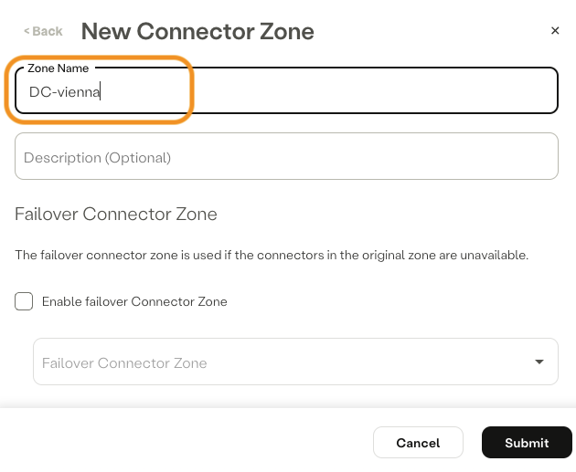

Step 3:

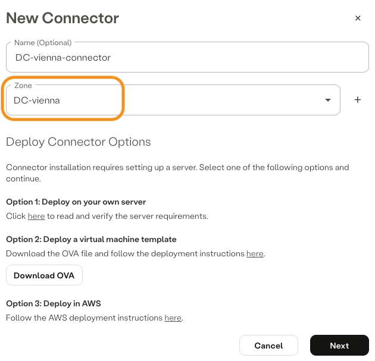

Step 4:

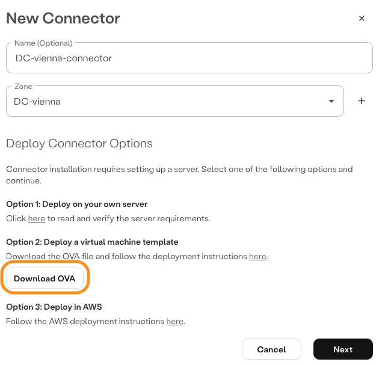

❗right-click on `Download OVA` and copy link address and save it to a text editor of your choice❗

Step 5:


❗click on `copy` and save the one-time code generated to a text editor of your choice, one-time code is required for the initial activation❗

Step 6:

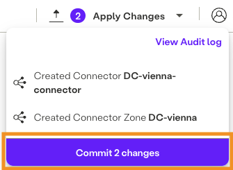

🔥 COMMIT CHANGES 🔥

## TASK 3: Create a Virtual Machine for the Atmos Connector on Proxmox Virtual Environment

`ssh`as `root` to your Proxmox Virtual Environment instance and run following commands:

### Change directory to `root`:
```text
cd /root
```

### Create directory `ova-import`:
```text
mkdir ova-import
```

### Change directory to `ova-import`:
```text
cd ova-import/
```

### Download Atmos Connector OVA:
```text
wget https://download.axissecurity.com/ova/axis-connector-ova-rocky-linux/axis-connector-rocky-linux-9-nci.ova
```

### Extract Atmos Connector OVA:
```text
tar xvf axis-connector-rocky-linux-9-nci.ova 
```

### Create a virtual machine based on the file with the extension `.ovf`:
```text
qm importovf 999 axis-connector-rocky-linux-9-nci-docker-v3.51.1.ovf local-lvm --format qcow2
```
💡Note: 
- `999`is the VM ID feel free to change the value.
- `local-lvm`is the default storage ID, change the value to match your setup.

🔨 Following `warning` messages can be ignored:
```text
warning: unable to parse the VM name in this OVF manifest, generating a default value
invalid host ressource /disk/vmdisk1, skipping
```

### Attach the Atmos Connector disk to the new VM:
```text
qm importdisk 999 axis-connector-rocky-linux-9-nci-docker-v3.51.1-disk1.vmdk local-lvm --format qcow2
```
💡Note: if you changed the VM or storage ID, change the values to match your setup.

### Switch to the Graphical User Interface of your Proxmox Virtual Environment instance and complete the virtual machine setup:

Select the VM and follow these steps:

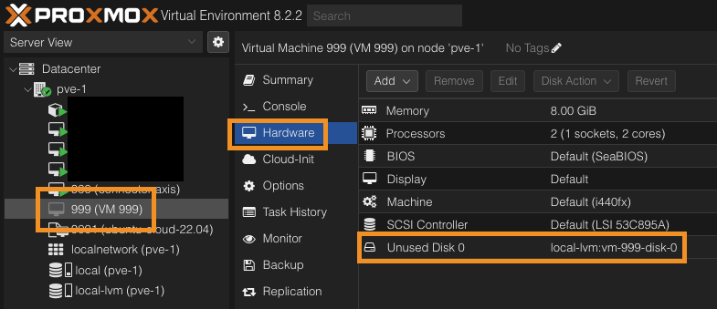

Step 2:

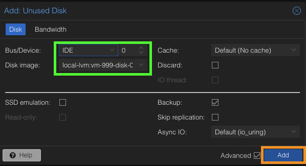

Step 3:

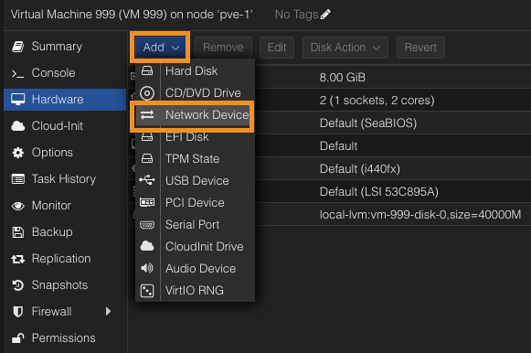

Step 4:

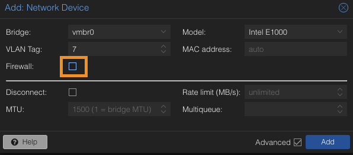

💡Note: 
- change the `Bridge` and `VLAN Tag:` values to match your network setup

Step 5:


Step 6:

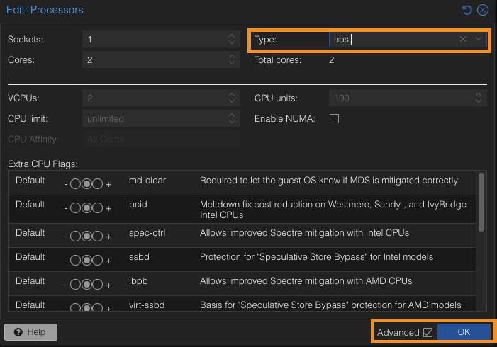

Step 7:

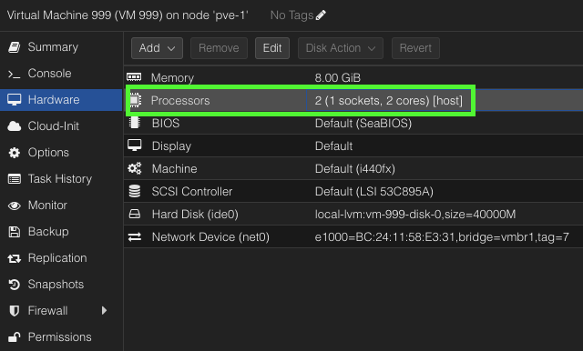

Step 8:

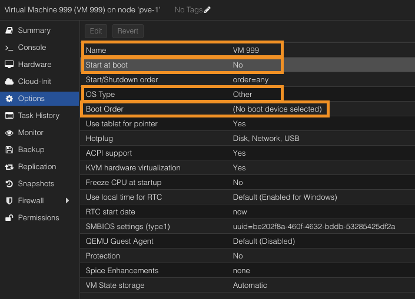

Step 9:

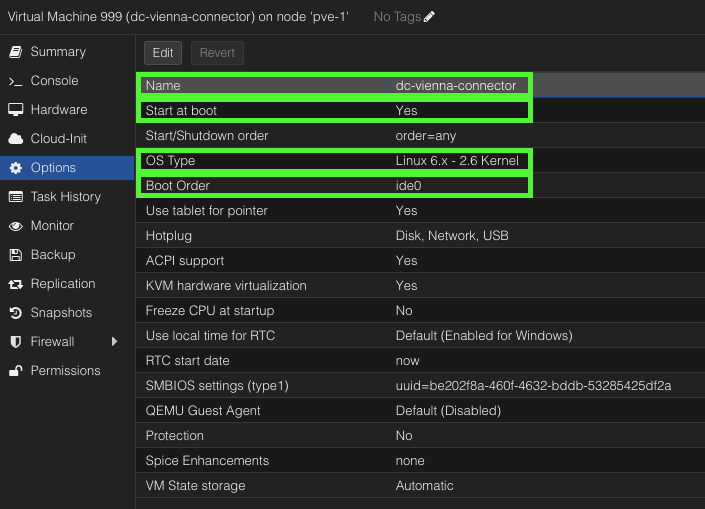

## TASK 4: Deploy the Atmos Connector on Proxmox Virtual Environment

Start the VM and connect using Proxmox Virtual Environment `>_ Console` and complete the login with username `axis` and password `axis`.

❗if you are using DHCP make sure that the ATMOS Connector IP address is reserved by your DHCP-Server, alternatively configure a static IP before running the one-time code❗

Run the one-time code generated in TASK 2 at Step 5.

Example:
```text
sudo bash < <(curl -fsSL https://ops.axissecurity.com/TOKEN/install)
```

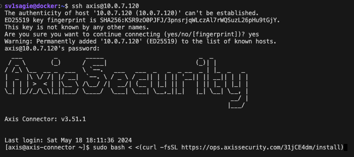

Step 2:


Step 3:

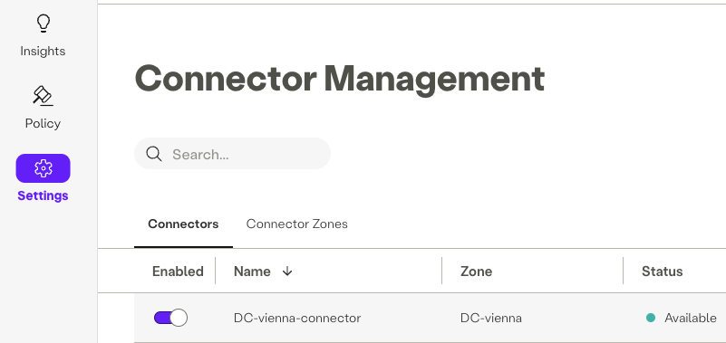

## 🚀 ATMOS CONNECTOR UP AND RUNNING!

<!-- ## ⭐️ OPTIONAL TASK 5: Change default username and password -->