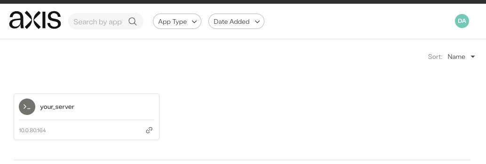

[Proxmox Virtual Environment]: https://www.proxmox.com/en/
[Axis Security]: https://www.axissecurity.com/schedule-a-demo/
[Axis Security Workspace]: https://auth.axissecurity.com/
[Linux Server - Ubuntu 22.04.4 LTS Jammy]: https://cloud-images.ubuntu.com/jammy/current/

# Use Case

User requires `ssh` access from an `unmanaged device` to an `internal hosted server`.

Requirements:
- Identify the user
- Single Sign-On experience
- Access policy based on least privilege
- Remove the `unmanaged device` from being placed into the internal network with a client vpn

# ✅ Prerequisites

- [Axis Security Workspace]

- [Linux Server - Ubuntu 22.04.4 LTS Jammy]

# System Information

- Linux Server: Ubuntu 22.04.4 LTS Jammy

# ⚙️ Installation

## TASK 1: Linux Server Setup - SSH

### Update your package list:
```text
sudo apt update
```

### Install OpenSSH server:
```text
sudo apt install openssh-server
```

### Start SSH service:
```text
sudo systemctl start ssh
```

### Start SSH service at boot:
```text
sudo systemctl enable ssh
```

## OPTIONAL TASK 2: SSH authentication with rsa key
💡[Skip to Task 3](#task-3-create-a-ssh-application) if you want to use username and password authentication

### Change to user home direcotry && create `.ssh/` directory && change directory to `.ssh/`
```text
cd && mkdir .ssh/ && cd .ssh/
```
💡 if `.ssh/`directory is already present, just change directory
### 
```text
cd && cd .ssh/
```

### Create RSA keys
```text
ssh-keygen -t rsa -b 4096 -C "your_email@example.com"
```
❗Important❗
- leaving the passphrase empty will allow you to authenticate purely with your rsa key
- bear in mind the risk of copying an unprotected rsa key to a file system without proper protection e.g., usb, public share and more

### Append the content of ìd_rsa.pub` to `authorized_keys`
```text
cat id_rsa.pub >> authorized_keys
```

### Set key permissions:
```text
chmod 600 id_rsa && chmod 644 id_rsa.pub
```

### Verify key permissions:
```text
ls -l
```

CLI output:
```text
-rw------- 1 your_username your_username 2223 May 20 06:41 authorized_keys
-rw------- 1 your_username your_username 3389 May 20 06:24 id_rsa
-rw-r--r-- 1 your_username your_username  748 May 20 06:24 id_rsa.pub
```

### Helpful information:
💡Increase security by updating your SSH configuration:
- Disable root login
```text
PermitRootLogin no
```
- Allow only specific users
```text
AllowUsers your_username
```
- Disable password authentication
```text
PasswordAuthentication no
```

## TASK 3: Create a `ssh` application

### Connect to the Management System of Axis Security:

```text
https://manage.axissecurity.com/
```

### Create a 'Self-Hosted Application':
Navigate to `Settings` ➡️ `Destinations` ➡️ `New Application`

1) Enter ssh and chose `SSH Server`


2) Enter application name


3) Enter server IP or domain
💡If domain is used validate your Atmos Connectors DNS configuration.


4) User authentication
User will be asked to enter the server credentials:


User will be provided with a single sign-on experience:
- Authentication method `username` and `password`


- Authentication method `username` and `rsa key`


- Verify the provided credentials


- Select the `Identity Provider` the user or group is part of

💡create an additional self-hosted application, if you want to use multiple identity provider


- Add a tag value, if you want to group self-hosted application to simplify the rule management
💡keep in mind that grouping should still follow least privilege


## TASK 4: Grant access by updating your Policy
Navigate to `Poliicy` ➡️ `Rules` ➡️ `New Rule`

Edit to match your setup:
- `Name`
- `Description`
- `Identity`
- `Destination`
- change `Action` to `Allow`
- Optional your created `SSH Profile`


Optional: Create a custom SSH profile


❗Important - commit changes❗
Navigate to the top right and commit changes


## 🚀 ZERO TRUST ACCESS ENABLED!

# What have we accomplished?

- Identify the user

✅ We verify the identitiy of the user using a trusted Identity Provider

- Single Sign-On experience!

✅ seemless login
⭐️ no server credentials are shared with the user by using the predefined credentials

- Access policy based on least privilege!

✅ SSH access to the linux server is limited to this user!

- Remove the `unmanaged device` from being placed into the internal network with a client vpn

✅ granted web-based access without granting internal network access!

# User Experience





# ⭐️ BONUS ⭐️
## Administrator can lookup user performed actions
Navigate to `Insights` ➡️ `Dashboard` and select the session

