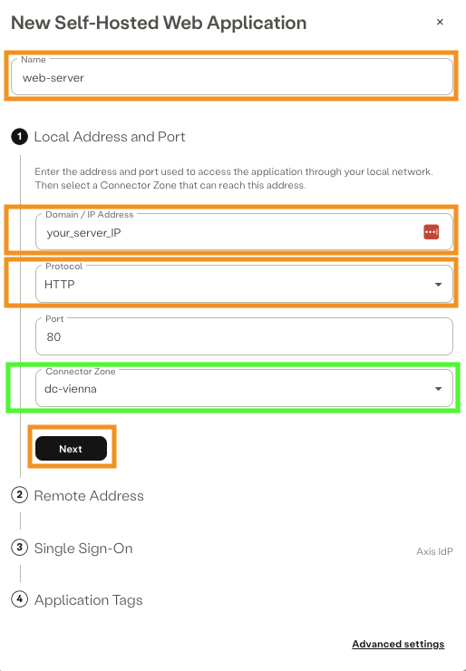

[Proxmox Virtual Environment]: https://www.proxmox.com/en/
[Axis Security]: https://www.axissecurity.com/schedule-a-demo/
[Axis Security Workspace]: https://auth.axissecurity.com/
[Linux Server - Ubuntu 22.04.4 LTS Jammy]: https://cloud-images.ubuntu.com/jammy/current/
[Install Docker Engine on Ubuntu]: https://docs.docker.com/engine/install/ubuntu/

# Use Case

User requires `web` access from an `unmanaged device` to an `internal web server`.

Requirements:
- Identify the user
- Access policy based on least privilege
- Remove the `unmanaged device` from being placed onto the internal network with a client vpn

# ✅ Prerequisites

- [Axis Security Workspace]

- [Linux Server - Ubuntu 22.04.4 LTS Jammy]

# System Information

- Linux Server: Ubuntu 22.04.4 LTS Jammy

# ⚙️ Installation

## TASK 1: Install docker and complete post-installation steps
Offical resource: [Install Docker Engine on Ubuntu]

### Uninstall all conflicting packages:
```text
for pkg in docker.io docker-doc docker-compose docker-compose-v2 podman-docker containerd runc; do sudo apt-get remove $pkg; done
```

### Set up Docker's `apt` repository:
```text
# Add Docker's official GPG key:
sudo apt-get update
sudo apt-get install ca-certificates curl
sudo install -m 0755 -d /etc/apt/keyrings
sudo curl -fsSL https://download.docker.com/linux/ubuntu/gpg -o /etc/apt/keyrings/docker.asc
sudo chmod a+r /etc/apt/keyrings/docker.asc

# Add the repository to Apt sources:
echo \
  "deb [arch=$(dpkg --print-architecture) signed-by=/etc/apt/keyrings/docker.asc] https://download.docker.com/linux/ubuntu \
  $(. /etc/os-release && echo "$VERSION_CODENAME") stable" | \
  sudo tee /etc/apt/sources.list.d/docker.list > /dev/null
sudo apt-get update
```

### Install the latest docker packages:
```text
sudo apt-get install docker-ce docker-ce-cli containerd.io docker-buildx-plugin docker-compose-plugin
```

### Add your user to the docker group:
```text
sudo usermod -aG docker $USER
```

### OPTIONAL - add docker to start on boot:
```text
sudo systemctl enable docker.service
sudo systemctl enable containerd.service
```

### Activate permission changes for the current user:
Recommended: Log out and log back in so that your group membership is re-evaluated.

💡Running `newgrp docker` to update priviliges did work only partially for me, I still experienced permission issue especially with Visual Studio Code extensions.

## TASK 2: Create web server based on `nginx` with `docker`

### Create a new directory structure in your users home directory `docker/web-server/`:
```text
cd && mkdir docker && cd docker/ && mkdir web-server && cd web-server
```

### Create a new file:
```text
nano docker-compose.yml
```

### Insert this code and save the file:
```text
services:
  nginx:
    image: nginx:latest
    ports:
      - "80:80"
    volumes:
      - ./html:/usr/share/nginx/html
      - ./nginx.conf:/etc/nginx/nginx.conf
```

💡 save and exit file editor `nano`: 
1) `STRG`+ `X`
2) `y`
3) `enter`

### Create a new file:
```text
nano nginx.conf
```

### Insert this code and save the file:
```text
events {}

http {
    server {
        listen 80;
        location / {
            root /usr/share/nginx/html;
            index index.html;
        }
    }
}
```

### Create a new directory:
```text
mkdir html && cd html/
```

### Create a new file:
```text
nano index.html
```

### Insert this code and save the file:
```text
<!DOCTYPE html>
<html lang="en">
<head>
    <meta charset="UTF-8">
    <meta name="viewport" content="width=device-width, initial-scale=1.0">
    <title>Zero Trust Principles Showcase</title>
    <style>
        body {
            font-family: Arial, sans-serif;
            margin: 0;
            padding: 0;
            display: flex;
            justify-content: center;
            align-items: center;
            height: 100vh;
            background-color: #f5f5f5;
        }
        .container {
            text-align: center;
            padding: 20px;
            border: 1px solid #ddd;
            background-color: #fff;
            box-shadow: 0 0 10px rgba(0, 0, 0, 0.1);
            max-width: 600px;
        }
        h1 {
            color: #333;
        }
        p {
            color: #666;
        }
        a {
            color: #007bff;
            text-decoration: none;
        }
        a:hover {
            text-decoration: underline;
        }
    </style>
</head>
<body>
    <div class="container">
        <h1>Zero Trust Principles Showcase</h1>
        <p>Welcome to our internal web server.</p>
        <p>Zero Trust is based on the principle of "never trust, always verify" and involves:</p>
        <ul>
            <li>Continuous verification of all entities.</li>
            <li>Strict access controls and least privilege access.</li>
            <li>Micro-segmentation and granular perimeter enforcement.</li>
        </ul>
        <p>For more information, visit the following resources:</p>
        <p><a href="https://www.nist.gov/news-events/news/2020/09/nist-releases-draft-zero-trust-architecture-special-publication" target="_blank">NIST Zero Trust Architecture</a></p>
        <p><em>Thank you for visiting our showcase.</em></p>
    </div>
</body>
</html>
```

### Change directory:
```text
cd ../
```

### Install `docker-compose`:
```text
sudo apt install docker-compose -y
```

### Launch your `nginx` web server:
```text
docker-compose up -d
```

### Verify that your `nginx` web server is working:
```text
curl localhost:80
```

💡 It's working if the curl output matches our index.html content  

## TASK 3: Add the internal web server as `Self-Hosted Web Application`

### Connect to the Management System of Axis Security:

```text
https://manage.axissecurity.com/
```

### Create a 'Self-Hosted Application':
Navigate to `Settings` ➡️ `Destinations` ➡️ `New Application`

1) Enter web and select `Self-Hosted Web Application`


2) Edit to match your setup
- `Name`
- `Domain / IP Address`
- change `Protocol` from `HTTPS` to `HTTP`
- verify `Port` equals `80`
- select your matching `Connector Zone`

💡If domain is used validate your Atmos Connectors DNS configuration.



3) Choose to keep or change the generated subdomain


4) Select the `Identity Provider` the user or group is part of

💡create an additional self-hosted application, if you want to use multiple identity provider


5) Submit to create our `Self-Hosted Web Application`

- Add a tag value, if you want to group self-hosted application to simplify the rule management

💡keep in mind that grouping should still follow least privilege


## TASK 4: Grant access by updating your Policy

Navigate to `Poliicy` ➡️ `Rules` ➡️ `New Rule`

### Edit to match your setup:
- `Name`
- `Description`
- `Identity`
- `Destination`
- change `Action` to `Allow`
- Optional your created `Web Profile`


⭐️ Optional: Create a custom 'Web Profile'

❗Important - commit changes❗
Navigate to the top right and commit changes


## 🚀 ZERO TRUST ACCESS ENABLED!

# What have we accomplished?

- Identify the user

✅ We verify the identitiy of the user using a trusted Identity Provider

- Access policy based on least privilege!

✅ Web access is limited to this user!

- Remove the `unmanaged device` from being placed into the internal network with a client vpn

✅ granted web-based access without granting internal network access!

# User Experience


